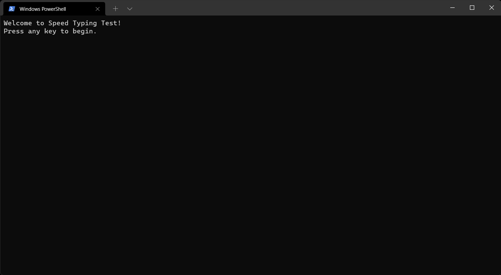
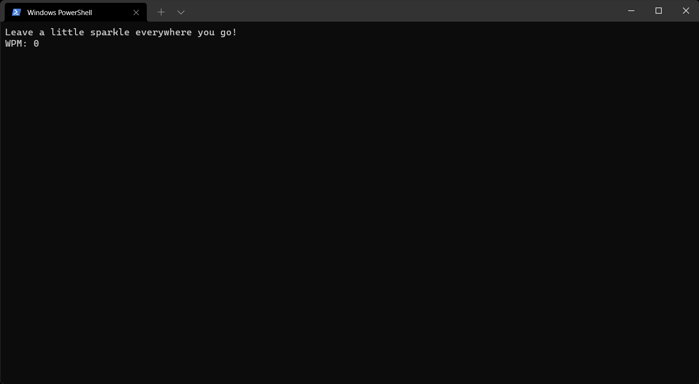
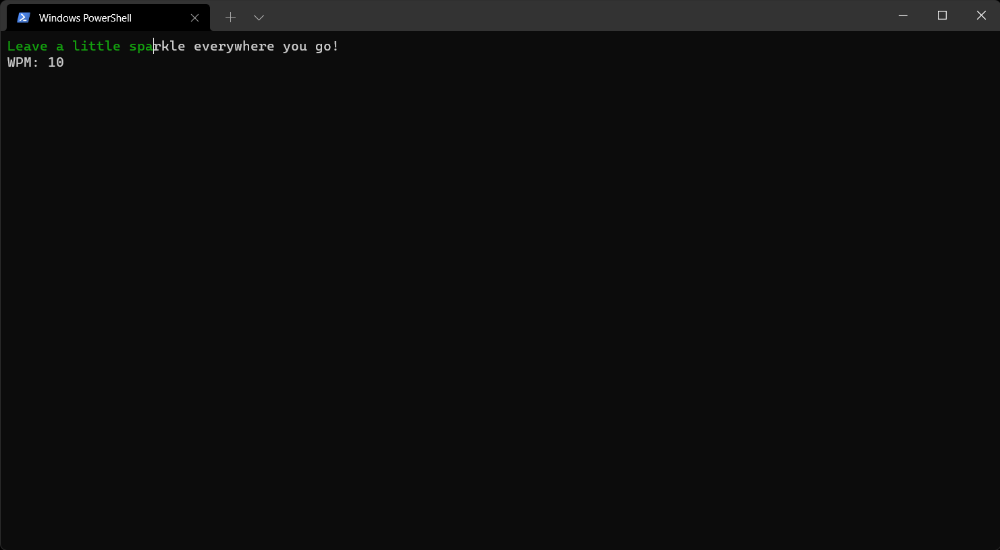
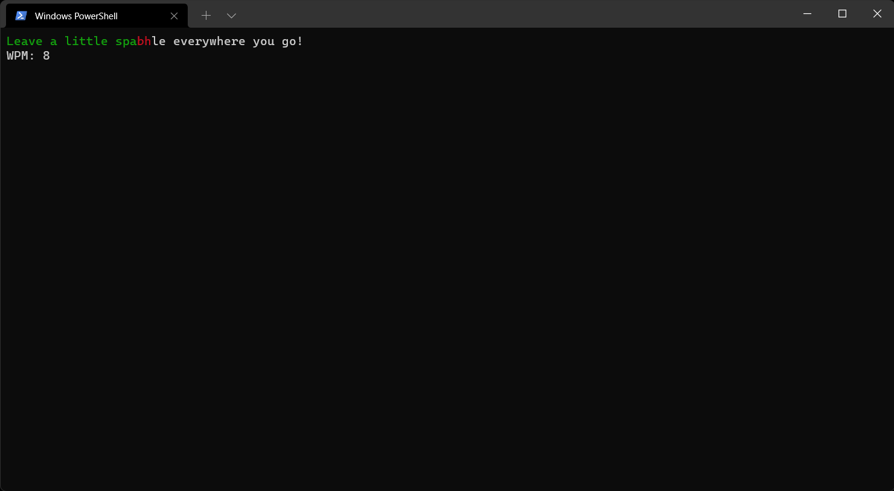
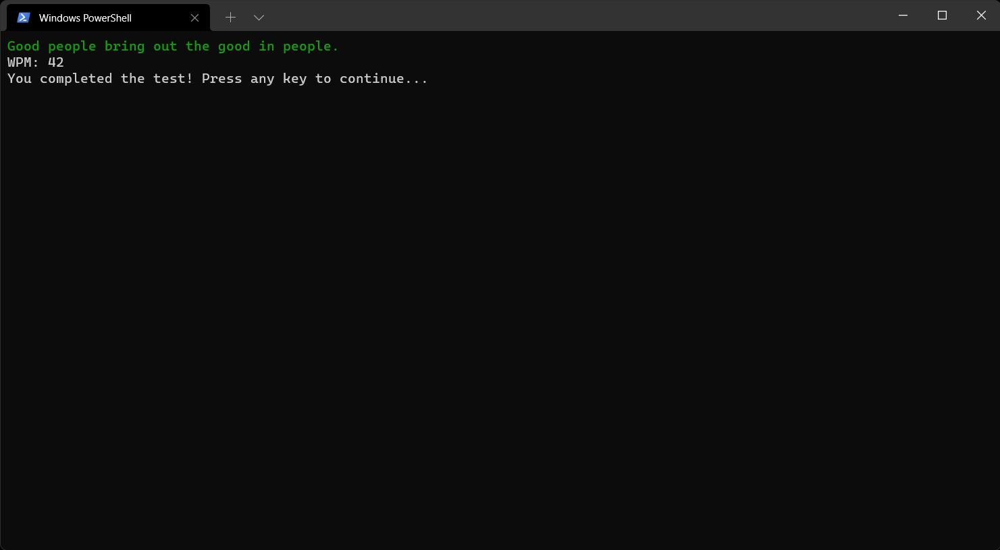

# Word Typing Speed

---
## Description
- This project runs on terminal. Go to terminal and run command "python code.py".
- Any random statement from text.txt is displyed on the screen.
- You have to start typing the same statement, and WPM is calculated based on yur speed of typing.
- If you write correct, words will be shown in green colour, otherwise in red colour.
- Using Backspace key will help you go back in the text.
- Using Escape key will help you to quit the test.

---
## Python Modules
- Python curses module.
- Python wrapper.
- Python time module.
- Python random module.

---
